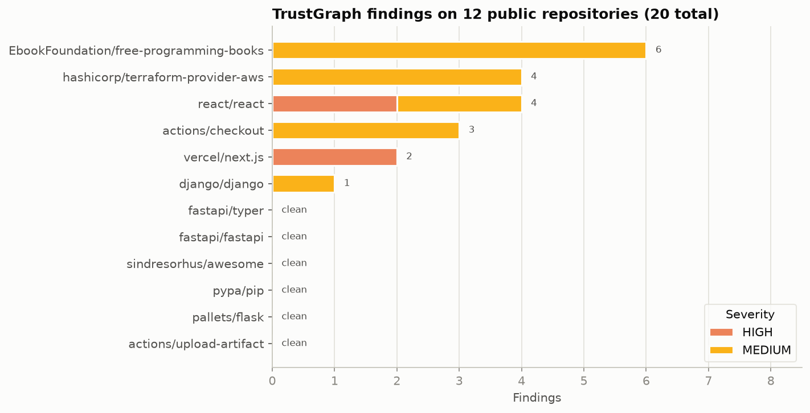
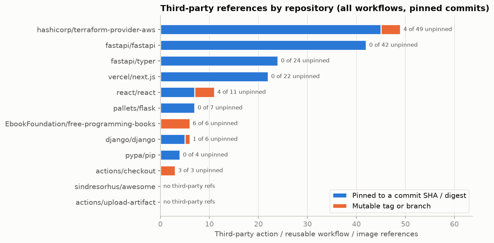
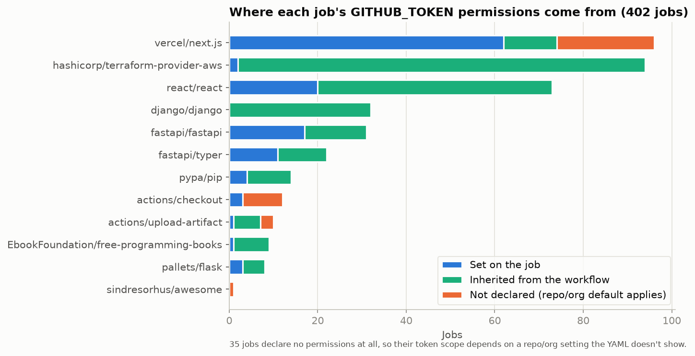

# Real-world evaluation

TrustGraph's unit tests use hand-built fixtures, which prove the rules fire
on cases written to trigger them. They don't show how the rules behave on
workflows nobody wrote for a scanner. So TrustGraph was run against the
real CI configuration of 12 public repositories.

## Method

- **Every workflow file, not a hand-picked one.** All 188 files under
  `.github/workflows/` in 12 repositories, so the sample isn't chosen by
  the person grading it. (An earlier version of this evaluation scanned one
  hand-picked workflow per repo and kept no copy of what it scanned.)
- **Pinned and kept.** Each repository is pinned to the commit its default
  branch pointed at on 2026-10-05, and every file is stored in
  `data/raw/real_workflows/` with its SHA-256 in `manifest.json`. Anyone
  can re-download the same bytes and check them
  (`python scripts/fetch_real_workflows.py`).
- **Every intermediate table is written out.** Instead of "inspected by
  hand", `scripts/evaluate_real_workflows.py` writes one row per action
  reference and one row per job (where its token permissions come from,
  whether it requests an OIDC token, which scopes it can write). Every
  number below can be recomputed from those CSVs.
- **No trust policies.** IAM trust policies aren't published next to a
  repo's workflows, so the three rules that need one are not exercised
  here (see "What this does not cover").

```bash
python scripts/fetch_real_workflows.py      # re-download the pinned files, verify checksums
python scripts/evaluate_real_workflows.py   # scan, write data/clean/ and data/processed/
python scripts/verify_findings.py           # re-check each finding without TrustGraph's parser
python scripts/make_charts.py               # docs/figures/
```

## Headline numbers

| | |
|---|---|
| Repositories / workflow files / jobs | 12 / 188 / 402 |
| Files the parser rejected | 0 |
| `uses:` references (steps, reusable workflows, images) | 868 |
| GitHub-owned (`actions/*`, `github/*`) | 673 |
| References back into the scanned repo itself | 21 |
| Third-party references | 174, of which **156 pinned** to a commit SHA or image digest and **18 not** |
| Jobs requesting an OIDC token (`id-token: write`) | 73 |
| Jobs declaring no token permissions at all | 35 |
| Findings | **20** (4 HIGH, 16 MEDIUM) in 6 of 12 repositories |

Source: `data/processed/summary.json`, `summary_by_repo.csv`.





## The findings

| Repository | Severity | Rule | What |
|---|---|---|---|
| react/react | HIGH ×2 | unpinned-action | `dtolnay/rust-toolchain@stable` and `rust-lang/crates-io-auth-action@v1` in the crates.io `publish` job, which requests an OIDC token. A moved tag runs with the token that publishes to crates.io |
| vercel/next.js | HIGH ×2 | overpermissioned-token | `publishRelease` (`build_and_deploy.yml`) and `release` (`release-next-rspack.yml`) hold `contents: write` together with `id-token: write`. Release jobs often need both (tagging plus npm provenance); splitting the token request into its own job would remove the overlap |
| EbookFoundation/free-programming-books | MEDIUM ×6 | unpinned-action | Every third-party reference is a tag, including `tj-actions/changed-files@v46` twice. In March 2025 attackers retroactively moved that action's version tags to a malicious commit ([CVE-2025-30066 / GHSA-mrrh-fwg8-r2c3](https://github.com/advisories/GHSA-mrrh-fwg8-r2c3)): the exact attack this rule exists for. A SHA pin is not affected by a moved tag |
| hashicorp/terraform-provider-aws | MEDIUM ×4 | unpinned-action | Four HashiCorp-owned actions by tag (`v1`/`v2`). Same organisation, different repositories with their own access control, so still counted |
| react/react | MEDIUM ×2 | unpinned-action | `dtolnay/rust-toolchain@stable` in two jobs without an OIDC token |
| actions/checkout | MEDIUM ×3 | unpinned-action | `docker://bitnami/git:latest` and two `docker/*` actions by version tag |
| django/django | MEDIUM ×1 | unpinned-action | `psf/black@stable` in the linters workflow |

All 20 findings are confirmed against the raw YAML by
`scripts/verify_findings.py`, which reads the files with plain PyYAML
rather than TrustGraph's parser, so a parser bug can't confirm itself. Whether each one is a risk worth fixing is the repository owners'
call: the next.js case in particular reads as a deliberate trade-off.

## What the real data changed in TrustGraph

The scan surfaced three problems in TrustGraph itself, each now fixed and
covered by a test (`tests/test_hardening.py`):

1. **Reusable workflows and container images were invisible.** The parser
   only read steps' `uses:`. A job-level `uses: org/repo/.github/workflows/x.yml@v1`
   runs another repository's entire workflow, and `docker://image:tag`
   runs a mutable image; neither was ever checked. In this sample the fix
   produced one new true finding (`docker://bitnami/git:latest` in
   actions/checkout). The 6 unpinned reusable workflows it uncovered all
   turned out to be self-references (next point), so none is a finding.
2. **Self-references were reported as third-party.** React's workflows
   call `react/react/.github/workflows/...@main` and next.js uses
   `vercel/next.js/.github/actions/pr-auto-label@canary`. Those point into
   the scanned repository itself: anyone who can move that branch can
   already edit the calling workflow, so pinning adds nothing. Excluding
   them removed 7 findings (27 became 20): the 6 reusable workflows from
   point 1, plus next.js's composite action, which the original parser
   would also have flagged. This only
   showed up because `facebook/react` now redirects to `react/react`:
   scanned under its old name, the self-references looked foreign.
3. **Elevation was per workflow, not per job.** An unpinned action was
   rated HIGH if *any* job in the same file requested an OIDC token. Jobs
   run on separate runners with separate tokens, so the action could
   never reach that credential. It is now per job.

## Reading the clean results

6 of 12 repositories have no findings. That is backed by the inventory,
not just the absence of output: `data/clean/action_references.csv` lists
every reference with its pin status. fastapi/fastapi (42 third-party
references), fastapi/typer (24), vercel/next.js (22), pallets/flask (7) and
pypa/pip (4) pin every one. sindresorhus/awesome and
actions/upload-artifact use only GitHub-owned actions.

The sample still leans towards well-maintained projects, the population
least likely to have sloppy CI, so these rates say nothing about GitHub
as a whole.



35 jobs (22 of them in next.js) declare no `permissions:` at all. Their
token scope is whatever the repo or organisation default is, which the
YAML doesn't show. TrustGraph reports these as `unspecified` and does not
flag them, because it can't know whether the default is read or write.

## What this evaluation does not cover

- **The three trust-policy rules** (`wildcard-oidc-trust`,
  `missing-audience-restriction`, and the CRITICAL path to a named cloud
  resource) need an IAM trust policy, which isn't public for any of these
  repositories. They are covered by the unit tests and
  `examples/vulnerable-project` only. (`overpermissioned-token` needs only
  the workflow, which is why it could fire here.)
- **Job containers and service images** (`jobs.<id>.container`,
  `services:`) are not parsed. actions/checkout's `test.yml` runs a job
  inside `bitnami/git:latest`, which this evaluation doesn't count.
- **What an action does once it runs.** A pinned action can still be
  malicious, and an unpinned one may be harmless. TrustGraph checks
  whether the code can change under you, not whether it is safe.
